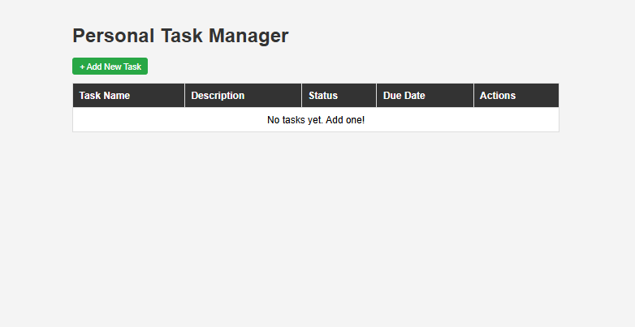
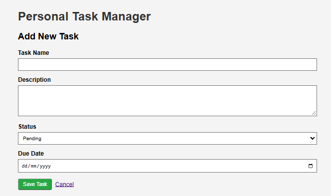
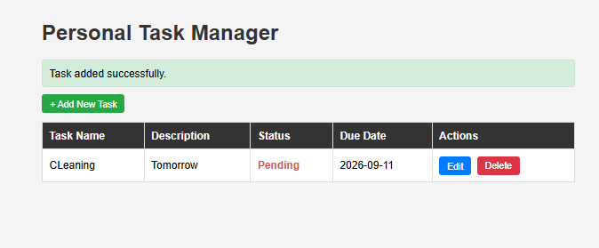
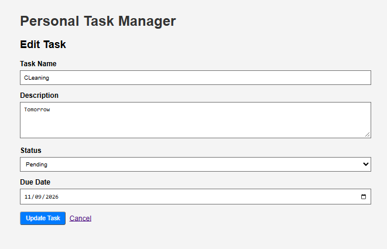
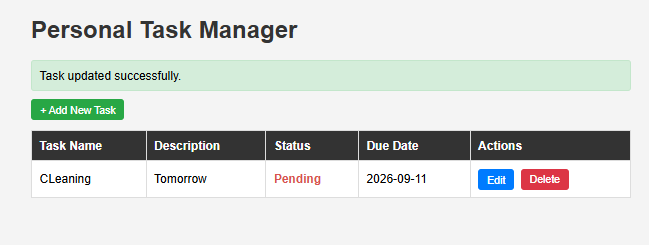
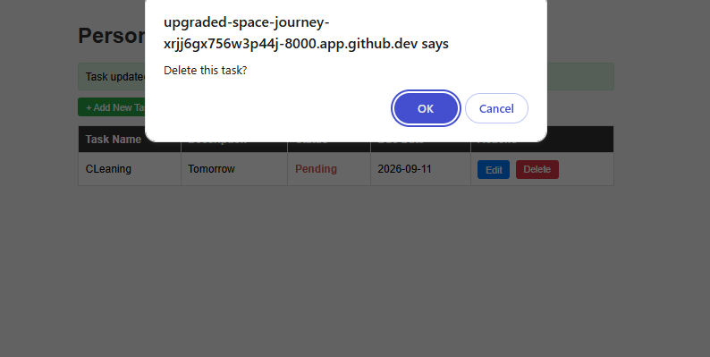
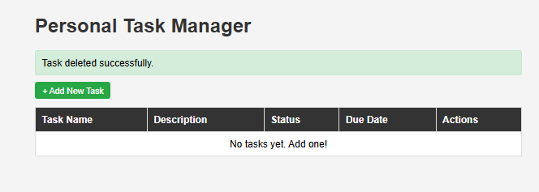

<div align="center">

# 📝 Task Manager

**A simple task management app with full CRUD and status tracking.**


</div>

---

## 📖 About

**Task Manager** is a project built for **WST21**. It lets users create, view, edit, delete, and track the progress of their tasks, with all data stored in a **SQLite** database.

## ✨ Features

| Feature | Description |
| :-- | :-- |
| ➕ **Add Task** | Create a new task |
| 📋 **View Tasks** | See all your tasks in one place |
| ✏️ **Edit Task** | Update the details of an existing task |
| 🗑️ **Delete Task** | Remove a task you no longer need |
| 🔄 **Update Status** | Mark tasks as pending, in progress, or done |

## 🛠️ Tech Stack

- **Database:** SQLite
- **Language / Framework:** `TODO: e.g. PHP / Python / Node.js`

## 🚀 Getting Started

```bash
# 1. Clone the repository
git clone https://github.com/harukemizuno-a11y/amplayo_sec3.git

# 2. Go into the project folder
cd amplayo_sec3/task-manager

# 3. Install dependencies and run
# TODO: add your run command here
```

## 📁 Project Structure

```
amplayo_sec3/
├── task-manager/     # Main application
└── README.md
```

## 🖼️ Screenshots

### 🏠 Home



### ➕ Add Task



### 📋 Task Added



### ✏️ Edit Task



### 🔄 Task Updated



### 🗑️ Delete Confirmation



### ✅ Task Deleted




## 👤 Author

| | |
| :-- | :-- |
| **Name** | Jann Brixx Amplayo |
| **Course & Year** | BSIT 2nd Year |
| **Project Code** | `WST21-PM-2026-SF` |

---

<div align="center">

Made with ❤️ for WST21

</div>
